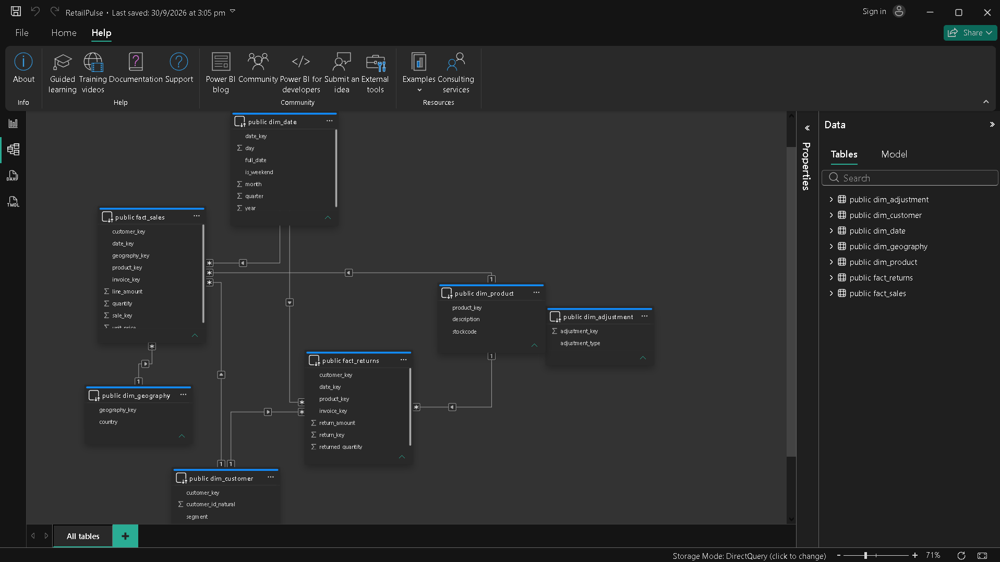

# RetailPulse — Business Intelligence Project 
    

**Course:** 23UDSPEL4704A – Business Intelligence | B.Tech CSE (Data Science), GHRCEM Pune
**Team:** Gaurav, [Add Teammate Name]

A Business Intelligence framework for customer value, returns, and sales performance
analytics in online retail — built end-to-end from raw, uncleaned transaction data to
a live, real-time-refreshing Power BI dashboard.

## Project Overview

- **Domain:** Online retail / e-commerce
- **Raw dataset:** [Online Retail II](https://archive.ics.uci.edu/dataset/502/online+retail+ii) — UCI Machine Learning Repository (NOT Kaggle, not pre-cleaned)
- **Business problem:** Revenue reporting doesn't net returns, no customer segmentation exists,
  and product KPIs are contaminated by non-product rows (postage, discounts, manual charges).
- **KPIs:** Net Revenue, Return Rate %, Average Order Value, Customer Lifetime Value,
  Repeat Purchase Rate, Revenue by Country.

## Technical Architecture

## Live Dashboard Preview then on the next line: 
